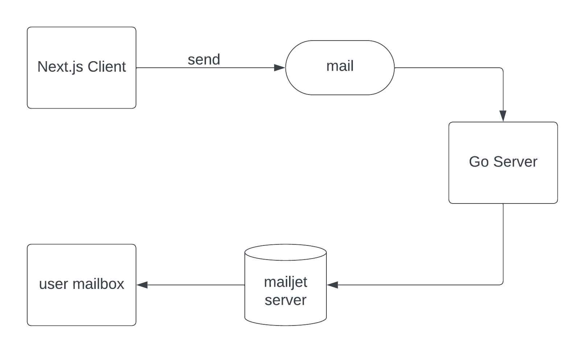

# dearself 🦄

Send emails to your future self! This project allows you to schedule emails to be sent at a future date. Perfect for setting reminders, goals, or just sending your future self a nice message. 

## Features 🚀
- Schedule emails for any date in the future
- Customize your email content
- Secure and private

## How to use 🛠️
1. Clone the repository
2. Install dependencies
3. Run the server
4. Schedule your emails

*Architecture of dearself project*
